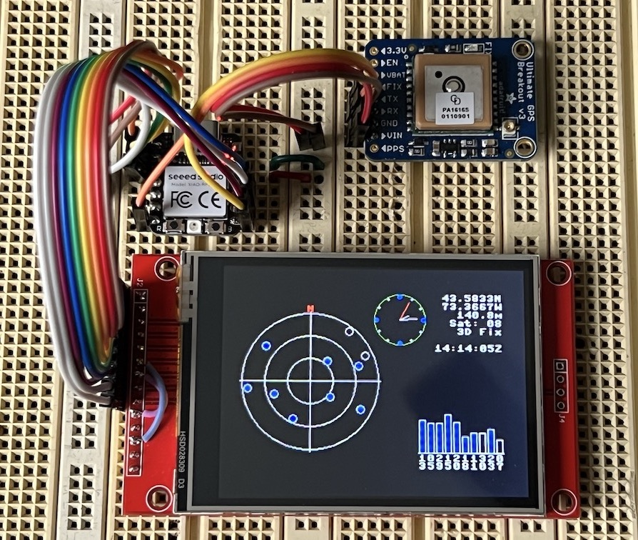

# GPS_RP2040_TFT_cpp
GPS implementation in C++ using RP2040 with ili9341 TFT display

- Background

  For some time I have been experimenting with GPS modules and NMEA sentence parsing.  Originally I designed the project using Micropython, but have more recently developed this C++ implementation by creating modules to abstract the GPS module, an LED for indication, and a display device.
  
- Hardware

  Raspberry Pi Pico RP2040-based microcontroller with UART and SPI ports, along with a simple 3.3 volt GPS module (in this implementation it's an AdaFruit GPS Breakout board), and in this case a 320x240 ili9341 TFT display.  The LED can be onboard the microcontroller or external.
  
  Make sure to specify the correct board in the top level CMakeLists.txt; in this implementation the Raspberry Pi Pico, Pico W, SeeedStudio XIAO RP2040 and Waveshare RP2040-Zero have been tested.  WS2812 LEDs are supported, as well as onboard and GPIO-connected simple LEDs.

  I also have a separate OLED implementation that uses an SSD1306 128x64 mono display.

- Software Requirements

  This implementation uses the Raspberry Pi Pico RP2040 controller C++ SDK:
  https://www.raspberrypi.com/documentation/microcontrollers/c_sdk.html

- Operation

  In main.cpp the required abstraction objects are created, and the program reads NMEA 0183 sentences from the GPS UART port.

  The data is correlated and displayed in textual and graphical form on the display.  For the TFT it displays the latitude, longitude, altitude, GMT time and an indication of the number of satellites and fix type.  A graphical representation of the satellite positions is displayed, as well as a satellite signal strength bar graph and a clock.

  An LED blinks to indicate the presence of a fix.  If a WS2812 LED is available, colors are used to indicate additional information, e.g. blink red for no fix, green for a fix using the GPS module onboard antenna, blue for external antenna; customization may be needed for the specific GPS module and LED.

- Enjoy!!
